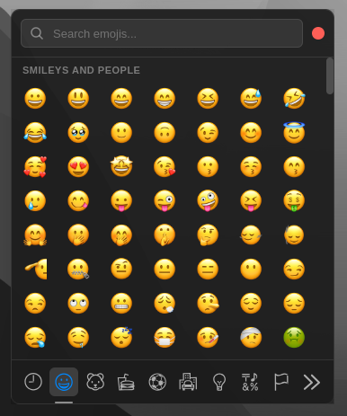
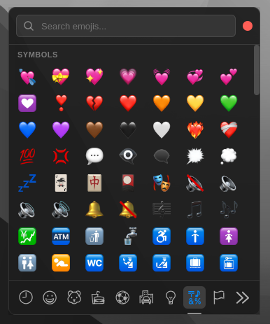

#  — an macOS-like emoji picker for Linux.
✨ Quick to open with (`Ctrl+;`) and copy emojis anywhere.

<p align="center">
  
  
</p>

> [!NOTE]
> This project is developed and tested on **Ubuntu Linux**.

> [!TIP]
> For best results use **GNOME**.

---

## Quick start

### Prerequisites

* Node.js **>= 20**
* npm
* (Optional) `git`

### Build & install

1. Clone and build:

   ```bash
   git clone https://github.com/a7mddra/Emojiz.git
   cd Emojiz
   npm install
   npm run dist
   ```

   After a successful build a `.deb` package will be created in `dist/`.

2. Install the `.deb`:

   ```bash
   sudo dpkg -i dist/emojiz_*.deb
   sudo apt-get install -f   # fix missing dependencies if prompted
   ```

3. Verify:

   ```bash
   Emojiz   # should launch the app
   ```

---

## Keyboard shortcut

The package adds a GNOME custom shortcut by default:

* **Shortcut:** `Ctrl+;`
* **Command:** `Emojiz`

If you're not using GNOME or prefer another keybind, open **Settings → Keyboard → Keyboard Shortcuts** and edit the custom shortcut.

---

## Development

Run the app during development:

```bash
npm start
```

Build the distributable:

```bash
npm run dist
```

---

## Uninstallation

Remove the app with apt:

```bash
sudo apt remove emojiz
```

The package `postrm` will remove the symlink `/usr/bin/Emojiz` if it was created by the installer.

---

## Contributing

Contributions welcome — open an issue or a PR. Please follow the repo coding/style guidelines and ensure you run the build/test steps locally before opening a PR.

---

## License

MIT © [a7md](mailto:a7mddra@gmail.com)
